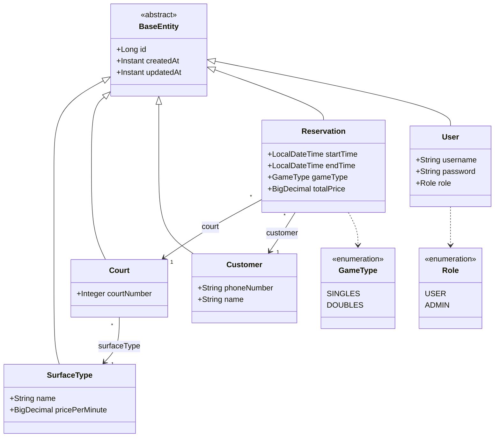
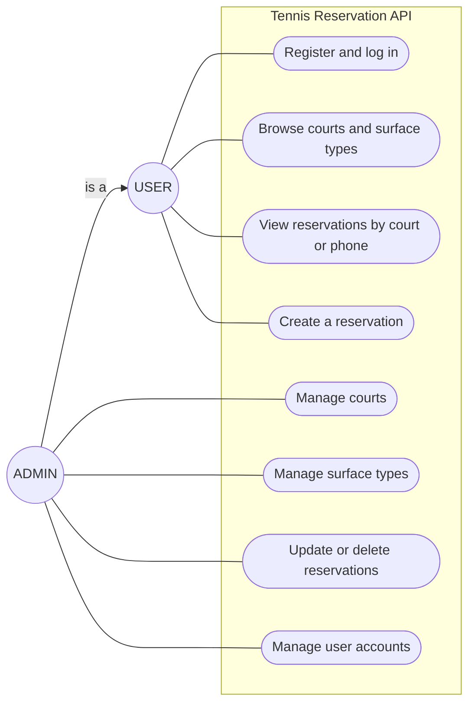

# Tennis Club Reservation

A server application for managing reservations in a tennis club: courts with different surface
types, per-minute pricing, and reservations validated against overlaps. Built with Spring Boot, a
hand-written JPA DAO layer, soft deletes on every entity, and JWT-secured REST
endpoints.

## Tech stack

- **Java 25**, **Spring Boot 4**
- **JPA / Hibernate** over an **H2** in-memory database
- **Liquibase** for database schema management
- **MapStruct** (DTO mapping), **Lombok** (boilerplate)
- **Spring Security** + **JWT** (jjwt) for authentication/authorization
- **springdoc-openapi** (Swagger UI)
- JUnit 5, Mockito, JaCoCo

## Build & run

```bash
./mvnw spring-boot:run        # start the app on http://localhost:8080
./mvnw verify                 # run all unit + integration tests
```

Once running:

| Resource | URL |
|---|---|
| Swagger UI | http://localhost:8080/swagger-ui/index.html |
| OpenAPI spec | http://localhost:8080/v3/api-docs |
| H2 console | http://localhost:8080/h2-console (JDBC `jdbc:h2:mem:tennisdb`, user `sa`, no password) |

## Configuration

External configuration lives in `src/main/resources/application.yaml`:

```yaml
app:
  init-data: true
  security:
    jwt:
      secret: ${JWT_SECRET:...}
      access-token-expiration: ${JWT_ACCESS_TOKEN_EXPIRATION:PT15M}
      refresh-token-expiration: ${JWT_REFRESH_TOKEN_EXPIRATION:P7D}
```

- **`app.init-data`** — when `true`, the app seeds **2 surface types**, **4 courts**, and two login
  accounts on startup (only if the database is empty).
- **JWT config** — the secret and both token validities are read from configuration and overridable
  via the `JWT_SECRET` / `JWT_ACCESS_TOKEN_EXPIRATION` / `JWT_REFRESH_TOKEN_EXPIRATION` env vars; the
  secret is a dev default and **must be overridden** in any real deployment.

### Seeded accounts (when `init-data` is on)

| Username | Password | Role |
|---|---|---|
| `admin` | `admin123` | `ADMIN` |
| `user`  | `user123`  | `USER` |

## Authentication & authorization

Authentication is **JWT**-based. New users can self-register via
`POST /api/auth/register` (always created as `USER`); `ADMIN` accounts come only from an existing
admin (`POST /api/users`) or startup seeding.

1. **Log in** with HTTP **Basic** credentials — `POST /api/auth/login`. On success the access token is
   returned both in the `Authorization` response header and in the JSON body, alongside a refresh token.
2. Send the access token as `Authorization: Bearer <token>` on subsequent requests.
3. **Refresh** — `POST /api/auth/refresh` with the refresh token returns a new access token (the
   refresh token itself is reused until it expires).

### Role matrix

- **USER** — read-only, **plus** the one exception of creating a reservation.
- **ADMIN** — everything.

| Area | USER | ADMIN |
|---|---|---|
| `GET` reads (courts, surface types, reservations) | ✅ | ✅ |
| `POST /api/reservations` | ✅ | ✅ |
| Court / surface-type writes, reservation update/delete | ❌ 403 | ✅ |
| `/api/users/**` (user management) | ❌ 403 | ✅ |

## Domain model (class diagram)



## Use cases (use-case diagram)


